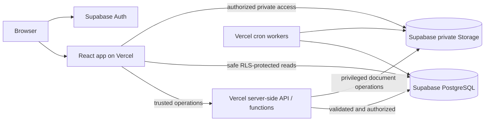

# Foundation architecture

Submission review uses immutable attempts and a database-owned transition function. Human decisions are tenant-scoped RPCs with row locking and expected-status checks. AI work is durable and server-only: browser roles have no queue privileges, and production AI remains capability-gated until a provider passes privacy and security approval. History reads reuse those immutable records through scope-checked projections; raw audit metadata is not browser-readable. See [Submission review](submission-review.md) and [Submission history](submission-history.md).

## Context and boundaries

The platform is one React application with distinct public, authentication, FSP and administration route areas. `Tenant`, `FSP` and `User` are separate domain identities. Controlled relationship tables link tenants to global FSPs and users to FSPs; the same FSP record may participate with multiple tenants.

## Runtime responsibilities

The browser handles presentation, form state and safe, RLS-protected calls. It contains only the Supabase URL and publishable key. It cannot grant access, approve claims, mutate authorization records or prove tenancy by providing an identifier.

Vercel Functions authenticate the caller, derive authorization from controlled database relationships, validate input, enforce business rules and then perform sensitive database or Storage operations. Server responses use the shared error envelope and never return SQL messages, secrets, stack traces or internal details.

Supabase Auth establishes identity only. PostgreSQL relationships and RLS determine authorization. User-editable `user_metadata` is never used for a security decision. The secret key bypasses RLS, so any function that uses it must perform complete authorization before data access.

## Frontend organization

Routes compose four layout shells. Feature code owns its pages, validation and service contracts. Shared visual controls live in `components/ui`; cross-feature application components live in `components/shared`. TanStack Query owns remote state while React Hook Form and Zod own form state and input validation. No global client state framework is introduced.

## API convention

API failures use `{ error: { code, message, details? } }` with explicit codes for validation (400), authentication (401), authorization (403), not found (404), conflict (409) and unexpected failures (500). Zod performs server validation. Unexpected errors are logged without request bodies or sensitive data and converted to a generic response.

## Security baseline

- HTTPS is provided by Vercel in deployed environments.
- Publishable and secret Supabase keys are separated and validated.
- Future exposed tables require RLS and explicit relationship-aware policies.
- Certificates, affidavits and supporting documents require private buckets.
- PostgreSQL stores document metadata; Storage stores binaries.
- Tenant/FSP access derives from authenticated identity and controlled relationships.
- Authorization-changing and document-control operations remain server-side.
- Dependencies are exact-versioned with a committed npm lockfile.
- Accessible native elements provide keyboard and focus behaviour.

## Implemented and deferred boundaries

Prompts 02–04 provide the relational schema, RLS, private Storage policy, seed identities,
Auth/profile trigger, session provider, authenticated route guard and FSP onboarding boundary.

The authenticated `/app` tree now resolves membership before choosing onboarding or the workspace.
`FspProvider` is the Prompt 05 hand-off: it supplies active memberships, the validated current FSP
and the selected role, while PostgreSQL remains authoritative. See
[onboarding.md](./onboarding.md). The FSP dashboard consumes that context and scopes submission reads
through an explicit tenant-FSP relationship; see [dashboard.md](./dashboard.md). The metadata-driven
questionnaire, version-aware route rules, certificate/declaration branches and atomic final submission
are documented in [submissions.md](./submissions.md). FSP-scoped invitations, user administration,
and the central role capability model are documented in [users-and-permissions.md](./users-and-permissions.md).
The global, FSP-scoped organisation profile and its regulatory/master/submission ownership boundary are
documented in [fsp-profile.md](./fsp-profile.md). The separate `/admin` insurer workspace, current-tenant
context, portfolio/queue read models and shared-FSP isolation are documented in
[insurer-portal.md](./insurer-portal.md). Administrator-only organisation, tenant user, submission
period, and FSP relationship settings are documented in [tenant-settings.md](./tenant-settings.md).
Human and durable AI review orchestration, immutable submission history, notifications, tenant settings and FSCA registry imports are implemented. Production approval is deliberately withheld until the P1 controls in [Production readiness](production-readiness.md) are closed.
