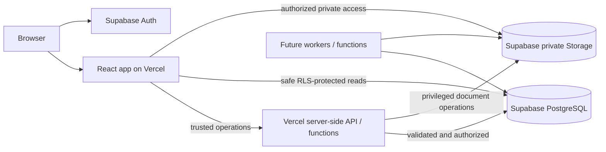

# Foundation architecture

## Context and boundaries

The platform is one React application with distinct public, authentication, FSP and administration route areas. `Tenant`, `FSP` and `User` are separate domain identities. A future controlled relationship links tenants to FSPs, and membership links users to FSPs; the same FSP record may participate with multiple tenants.

## Runtime responsibilities

The browser handles presentation, form state and safe, RLS-protected calls. It contains only the Supabase URL and publishable key. It cannot grant access, approve claims, mutate authorization records or prove tenancy by providing an identifier.

Vercel Functions authenticate the caller, derive authorization from controlled database relationships, validate input, enforce business rules and then perform sensitive database or Storage operations. Server responses use the shared error envelope and never return SQL messages, secrets, stack traces or internal details.

Supabase Auth establishes identity only. PostgreSQL relationships and RLS determine authorization. User-editable `user_metadata` is never used for a security decision. The secret key bypasses RLS, so any function that uses it must perform complete authorization before data access.

## Frontend organization

Routes compose four layout shells. Feature code owns its pages, validation and service contracts. Shared visual controls live in `components/ui`; cross-feature application components live in `components/shared`. TanStack Query owns remote state while React Hook Form and Zod own form state and input validation. No global client state framework is introduced.

## API convention

API failures use `{ error: { code, message, details? } }` with explicit codes for validation (400), authentication (401), authorization (403), not found (404), conflict (409) and unexpected failures (500). Zod performs server validation. Unexpected errors are logged without request bodies or sensitive data and converted to a generic response.

## Security baseline

- HTTPS is provided by Vercel in deployed environments.
- Publishable and secret Supabase keys are separated and validated.
- Future exposed tables require RLS and explicit relationship-aware policies.
- Certificates, affidavits and supporting documents require private buckets.
- PostgreSQL stores document metadata; Storage stores binaries.
- Tenant/FSP access derives from authenticated identity and controlled relationships.
- Authorization-changing and document-control operations remain server-side.
- Dependencies are exact-versioned with a committed npm lockfile.
- Accessible native elements provide keyboard and focus behaviour.

## Deferred to Prompt 02 or later

No schema, RLS/storage policy, bucket, seed identity, route authorization guard, claim flow, invitation, submission business logic, upload, affidavit, review, notification or FSCA import exists yet. Prompt 02 must define relationship cardinality, lifecycle/status values, audit requirements, RLS threat tests and private Storage object-path conventions before these placeholders become functional.
